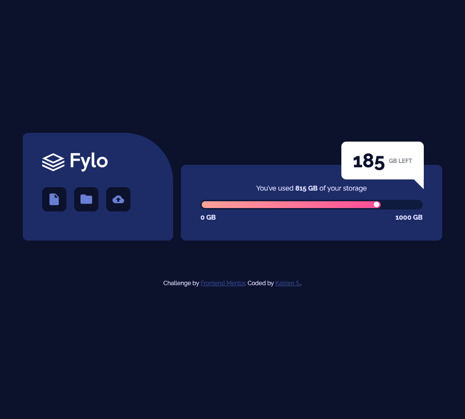

# Frontend Mentor - Fylo data storage component solution

This is a solution to the [Fylo data storage component challenge on Frontend Mentor](https://www.frontendmentor.io/challenges/fylo-data-storage-component-1dZPRbV5n). Frontend Mentor challenges help you improve your coding skills by building realistic projects.

## Table of contents

- [Overview](#overview)
  - [The challenge](#the-challenge)
  - [Screenshot](#screenshot)
  - [Links](#links)
- [My process](#my-process)
  - [Built with](#built-with)
  - [What I learned](#what-i-learned)
  - [Continued development](#continued-development)
  - [Useful resources](#useful-resources)
- [Author](#author)

## Overview

### The challenge

Users should be able to:

- View the optimal layout for the site depending on their device's screen size

### Screenshot

### Links

- Solution URL: [GitHub](https://github.com/katrien-s/fe-25-005-fylo-data-storage-component)
- Live Site URL: [Netlify](https://fe-25-005-fylo-data-storage-component.netlify.app/)

## My process

### Built with

- Semantic HTML5 markup
- CSS custom properties
- Flexbox
- CSS Grid
- Mobile-first workflow
- CSS Nesting

### What I learned

I used this exercise to familiarize myself with CSS Nesting. There is a different approach involved when writing the code. Especially in making sure I do the nesting correctly, maintain a high readability and don't take the nesting too deep.

### Continued development

I sure need to get more familiarized with nesting and deepdive in the [MDN Documents](https://developer.mozilla.org/en-US/docs/Web/CSS/Guides/Nesting).

### Useful resources

- [Getting started with CSS Nesting](https://www.youtube.com/watch?v=h4Xp1QgNkhU) - Who else but Kevin Powell would be introducing me to CSS Nesting.

## Author

- Frontend Mentor - [@katrien-s](https://www.frontendmentor.io/profile/katrien-s)
